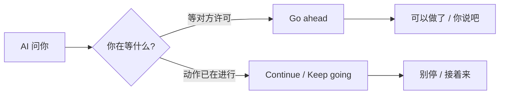

日常用 AI 写代码，我经常会遇到一个问题：它问我要不要继续，我回了个 **ok**，结果它就不写了。换成 yes，每次都能继续写，为什么不用 continue，因为我懒，不想打字。

遇到过很多次之后，我就在想为什么会这样呢？今天我换成了 go ahead，也能按照口令继续，于是尝试着探索了一下，结论是：ok 语义太模糊了，他更贴近语义“我知道了”，而不是请继续，在一些比较保守的 AI 工具中，比如 Cursor，遇到模糊不清的回答，会默认继续等待指令，而不是接着干活。要记住，AI 是执行指令的工具，想让他干活就得发布指令，而不是真的称兄道弟一样的日常 okook！

同样是指令，那么 go ahead 和 continue 有什么区别呢？下面是查资料做的一些笔记，大家可以看看。

## go ahead 和 continue 差在哪

这两个词都能翻成「继续」，但语气不一样。

|          | go ahead           | continue         |
| -------- | ------------------ | ---------------- |
| 语气     | 口语、随意         | 中性、偏正式     |
| 常见角色 | 许可、鼓励对方去做 | 描述动作在延续   |
| 隐含意思 | 可以了，你去做吧   | 接着做、接着进行 |

**go ahead** 偏人际互动：同意、催促、放行。

- "Can I open the window?" → "**Go ahead**."（可以，你开吧）
- "**Go ahead**, tell me what happened."（说吧，我听着）
- "I'll **go ahead** and send the email."（那我就先发了）

**continue** 偏状态描述：没停、接着进行、从中断处恢复。

- "Please **continue** reading."（请接着读）
- "**Continue** from where you left off."（从你停下的地方接着来）
- "To **continue**, click Next."（UI 里很常见）

一句话记：**go ahead ≈ 许可或主动开干；continue ≈ 动作或状态的延续。**

## AI 问「要继续吗」，回哪个

AI 问 "Should I continue?" 时，通常是在**等你许可**，不是在描述进度。

这时可以回“go ahead”，快去干吧！放开干吧！

单独回"Continue"也能懂，但有点像在下命令，略生硬，现在不都在讲 AI 平权嘛，既然是我们的小助手，那就公平交流吧，之前看网上说用这种公平的语气，AI 的回答会更好，也不知道真假。

## 详细讲讲回复“ok"为什么 AI 不继续了

我总结了几个常见原因，有些上面结论也说过。

### 1. ok 更像「收到了」，不像「请动手」

| 我的回复                 | AI 常见理解                    |
| ------------------------ | ------------------------------ |
| ok                       | 收到了 / 明白了 / 对话可以结束 |
| go ahead / yes, continue | 明确许可，继续做               |
| do it / implement it     | 明确指令，动手做               |

我说 ok，AI 可能觉得我在确认它刚才说的内容，而不是让它接着写代码。

### 2. 上一轮 AI 可能已经在收尾

如果它刚说完「以上是方案，你看有没有问题」或「需要的话我可以帮你实现」，我回 **ok**，它很容易理解成：**用户认可了，任务结束。**

它不会自动假设我还要它继续实现。

### 3. AI 偏保守

很多 AI 被设计成：没收到**明确动作指令**就不继续大段输出或改代码，避免「用户只是随口应一声，我却自作主张写一堆」。

所以”ok“这种模糊回复，容易触发「先停住，等更清楚的指示」。

## 该怎么用这些词汇呢？

下次 AI 问要不要继续，或者做完一半停下来，可以尽量说清楚**要什么动作**：

| 想让它…            | 我会这么说                         |
| ------------------ | ---------------------------------- |
| 继续写代码         | yes/Go ahead(and implement it)      |
| 接着上一步         | Continue(from where you left off)  |
| 做完整个任务       | Please finish the rest.            |
| 别只讲方案，要动手 | Don't just explain — implement it. |
