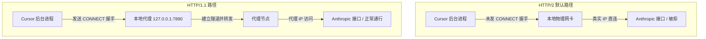

我们都知道，Claude 对访问区域限制很严。

在用 Cursor 写代码时，不少人都遇到过这个奇怪的现象：开了代理，浏览器访问 Claude 也完全正常，但在 Cursor 里只要调用 Claude/GPT 模型就会报错。而在设置里把网络协议从默认的 HTTP/2 改成 HTTP/1.1，又可以正常使用。

这涉及到网络协议和后台进程的一些知识。

## 两套独立的 Node.js 网络接口

在 Cursor 较新版本中，AI 通信等核心请求由一个独立的后台进程负责。许多人以为在设置里切换协议只是在同一个连接上换个版本号，但在 Node.js 运行时中，HTTP/1.1 与 HTTP/2 完全是由两套独立的底层模块在支撑。

HTTP/1.1 使用的是传统的 `node:http` 与 `node:https` 模块，以单次请求为核心，网络连接池挂载在 `Agent` 对象上。

HTTP/2 使用的则是 `node:http2` 模块。它的核心是长连接会话（`Http2Session`），客户端调用 `http2.connect()` 先与目标源站建立连接，再在该连接上开启多路复用流发送数据。

这两套模块对代理的处理逻辑完全不同，直接导致了网络表现的巨大差异。

## HTTP/2 为什么绕过了本地代理？

我们在本机运行的 Clash、v2ray 等工具，提供的本地 `7890` 端口本质上是传统的 HTTP/1.1 显式代理。

应用若想通过这种本地代理访问 HTTPS 目标，必须先遵循标准协议，向代理端口发送一条明文请求：

```http
CONNECT api.anthropic.com:443 HTTP/1.1
Host: api.anthropic.com:443
```

本地代理收到这条指令后，会在远端替客户端与目标服务器建立 TCP 连接，并向客户端返回 `200 Connection Established`。只有在这条双向管道打通之后，客户端才能在管道内部启动 TLS 握手，安全传输业务数据。

浏览器访问网页之所以正常，是因为浏览器在发起 HTTP/2 连接前，已经先通过本地代理完成了这条 `CONNECT` 隧道的搭建。

而 Node.js 的原生 `http2.connect()` 接口面向的是纯粹的目标源站。该接口没有内置类似 `Agent` 的代理钩子，默认不会读取系统代理，也不会主动向本地端口发起 `CONNECT` 握手。

同时，像 VS Code 体系中广泛使用的全局代理适配器（如 `@vscode/proxy-agent`），历史上主要通过劫持 `http.request` 和 `https.request` 来注入代理，并没有为 `http2.connect()` 提供全局透明支持。

结果就是，当 Cursor 启用 HTTP/2 时，底层代码直接拿着源站域名做 DNS 解析并向目标发起直连。流量完全没有经过本地的 `127.0.0.1:7890`，请求带着本机的真实境内 IP 直奔 Anthropic 接口，自然触发了区域限制。



## 切换到 HTTP/1.1 后，到底改变了什么？

所谓的传统传输模式，指的就是依托 `node:https` 搭配 HTTP CONNECT 隧道的网络链路。

当我们在设置中强制切换到 HTTP/1.1 时，Cursor 底层将网络请求切回了 `node:https` 模块。

在这条成熟的通路上，请求能够完整接入 ProxyAgent 机制。客户端在发起真正请求前，会主动向本地代理端口发送 `CONNECT` 请求完成握手，随后在隧道内完成 TLS 加密传输。

本地代理接管了整条数据链路，出站流量顺利被转交至代理节点，出口 IP 被替换，Claude 自然恢复了可用状态。

## 如何不降级协议，继续使用 HTTP/2

把协议切成 HTTP/1.1 确实能救急，但这是一种妥协。HTTP/1.1 缺乏单连接上的多路复用能力，在生成超长代码或者处理大上下文的时候，并发性能会下降，偶尔还会遇到响应变慢甚至连接中断的情况。

如果我们想继续享受 HTTP/2 的完整性能，有以下两种解决办法。

### 方案一：开启代理客户端的 TUN 模式（网络层接管）

常规的系统代理只在应用层生效，管不到没有主动向本地端口发起握手的后台进程。而 **TUN 模式（虚拟网卡模式）** 直接工作在网络层。

它会在操作系统里创建一张虚拟网卡，把整台电脑所有软件的出站流量强制接管过来。开启 TUN 模式后，即使 Cursor 的后台进程直接发起 TCP 连接而不走应用层代理握手，数据包到达网络层依然会被虚拟网卡拦截并送入代理分流。这样一来，速度和稳定性就能兼顾。

> 📌 **避坑小贴士**
> 使用 TUN 模式时，建议顺手检查一下分流规则（Rule），确保 `cursor.sh`、`cursor.com` 和 `anthropic.com` 相关的域名都配置为走代理节点（PROXY），避免被默认规则判定为直连（DIRECT）。

### 方案二：配置系统环境变量与终端代理

如果你不想开启全局 TUN 模式（比如不想安装虚拟网卡驱动，或担心其他本地服务受到影响），也可以通过环境变量为应用注入代理地址。

需要说明的是，对于原生调用 `http2.connect()` 的旧版本后台进程，单纯配置环境变量并不一定能让它自动建立 HTTP/2 代理隧道。但对于终端运行的 `claude-cli`、新版本 Cursor CLI、以及依赖标准库和 `fetch` 的工具链，底层会主动读取操作系统的代理环境变量并建立连接。

你可以获取代理软件的本地 HTTP 代理端口（以常见的 `7890` 为例），进行如下配置。

- **Windows 系统**
  右键“此电脑” → 属性 → 高级系统设置 → 环境变量。在“用户变量”或“系统变量”中新建两个变量：
  - 变量名 `HTTP_PROXY` ｜ 变量值 `http://127.0.0.1:7890`
  - 变量名 `HTTPS_PROXY` ｜ 变量值 `http://127.0.0.1:7890`
    _(配置完成后，需彻底重启 Cursor 才会生效)_

- **Mac / Linux 系统**
  在终端配置文件（如 `~/.zshrc` 或 `~/.bash_profile`）中加入：

  ```bash
  export http_proxy="http://127.0.0.1:7890"
  export https_proxy="http://127.0.0.1:7890"
  ```

  运行 `source ~/.zshrc` 刷新后，无论是从终端通过 `cursor .` 拉起编辑器，还是直接运行 `claude-cli`，都能正常通过代理环境访问。

## 总结

- **临时救急**
  在 Cursor 设置中把网络协议切为 **HTTP/1.1**，借由成熟的 `node:https` 模块走本地 HTTP CONNECT 隧道。
- **一劳永逸**
  开启代理软件的 **TUN 模式**，直接在网络层接管所有出站 TCP 流量。
- **精准适配**
  通过配置系统与终端**环境变量**，适配终端开发工具与具备代理识别能力的现代请求链路。
