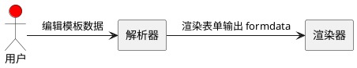

表单对于企业级应用来说是很重要的一个模块，表单一般都会有增删改查的需求，最简单的实现方式是有新的表单需求就写一份，这样重复劳动就很多了。稍微有点经验的程序员会抽一个公共模块出来，哪里有表单的需求就调用一下这个公共模块，生成一份，省去了很多的重复工作。那么这种公共模块我们会怎么设计呢？首先我们想到的是数据驱动视图思想，只要按照我们规定的格式输入数据，我们就能产生出一份符合需求的表单，这里我们发现还是不够省力，因为每次构建新的表单都需要我们自己去创建一份数据。是否可以让用户去创建这份表单数据供我们渲染呢？当然可以啦！这里我称之为表单可视化，大概实现思路就是用户通过编辑我们提供的可视化界面产出数据，表单解析器解析用户输入的表单数据，表单渲染器使用解析好的数据渲染表单，输出表单的 formdata，时序图如下：

从上述分析可以知道要实现表单可视化，需要有这样一个流水线：表单编辑器产出表单模板数据 => 表单解析器按标准解析模板数据 => 表单渲染器消费数据渲染出表单，这对于一般的基础组件来说是没什么问题的。但是遇上动态增删的组合组件会如何呢？比如用户需要一个可以在表单界面增删项目的组件，这时候上面的设计貌似就不太好用了。要知道模板数据是在产出时就已经生成投入流水线运作了，这时候运作到最后一步准备装箱了，让我们在这批货里新增几个新的产品，而由于产出模板的工人已经下班了，我们又不能回到开头去重新产出新的模板，这时候要怎么做呢？只能在渲染阶段改数据，这个阶段只能交付最终产品(formdata)，怎么让用户看到新的产品跟其他商品外观(模板)和内在材料(data)一样呢？ 

要解决上述问题，我们要思考的是怎么在一份 formdata 数据里面去同时存储到 data 和 template，一个组合组件由很多的基础组件组成，基于此，我的做法是把组合组件的 template 作为 data 去存，同时存储组个组件内每个基础组件的 data 到 formdata，下次渲染界面的时候就可以拿组合组件的 data 渲染出组合组件内的所有基础组件，而每个基础组件的 data 已经被存储到了 formdata 中，可以直接拿来填充。