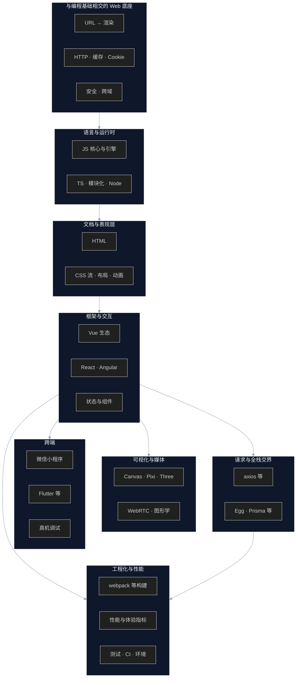

# Web 前端开发知识图谱（概念）

跨多篇 wiki 条目的**主题聚类**：把浏览器、语言、样式、框架、可视化、跨端、工程化连成一张可读的路径图，便于从「一点」跳到相关笔记。

**性质说明**：本页是依据 [`wiki/index.md`](../index.md) 已收录页面的归纳，不是某一篇 `source/_posts` 的转写；具体论断仍以各 `sources/*.md` 摘要为准。

## 总览

## 推荐阅读主轴（一条线串起来）

1. [从浏览器地址栏输入 URL 到界面被渲染出来看前端知识](../sources/what-happens-from-url-to-display.md)
2. [HTTP 笔记](../sources/http-notes.md) · [说说浏览器缓存机制](../sources/talking-about-browser-cache-mechanism.md) · [认识 Cookie](../sources/understanding-cookies.md)
3. [JS 概谈](../sources/js-overview.md) · [JavaScript 在 V8 引擎浏览器上是怎么执行的](../sources/js-execution.md) · [javaScript-promise](../sources/javaScript-promise.md)
4. CSS 可从 [CSS 系列文章——CSS 基础知多少](../sources/css-series-basics.md) 起，串 [CSS 常用布局及解决方案](../sources/css-layout-guide.md)
5. 框架：Vue 见 [Vue 数据驱动视图更新实现](../sources/vue-data-driven-view-implementation.md)、[Vue3 实战笔记](../sources/vue3-notes.md)；[Web 前端开发为什么要用框架](../sources/why-frontend-needs-framework.md)
6. 网络与安全：[关于跨域那些事](../sources/cross-origin-resource-sharing.md)、[Web安全 —— XSS攻击](../sources/web-security-xss-attack.md)；CSRF 见 [web 安全——CSRF](../sources/web-security-csrf.md)
7. 交付：[webpack](../sources/webpack.md)、[前端性能优化](../sources/frontend-performance-optimization.md)、[首屏时间(FCP) VS 白屏时间(FP)](../sources/first-screen-time-vs-white-screen-time.md)

## 区域 ↔ 代表条目（索引速查）

| 区域 | 代表条目（节选） |
| --- | --- |
| URL / 渲染 / 内核 | [浏览器渲染原理概述](../sources/how-to-optimize-animation.md)、[关于浏览器内核及其 CSS 写法](../sources/browser-kernel-and-writing.md) |
| 样式与适配 | [说说网页自适应和响应式布局](../sources/talking-about-webpage-adaptive-and-responsive-layout.md)、[盒模型](../sources/box-model.md)、多篇 `css-series-*` |
| Vue | [我所不知道的 Vue 细节](../sources/vue-details-i-didnt-know.md)、[说说 Vuex](../sources/talking-about-vuex.md) |
| 图形 | [three.js 基础实战 —— 创建画布](../sources/three-js-basics-practice.md)、[PixiJs 极简教程](../sources/pixi-basics.md)、[WebRTC](../sources/WebRTC.md) |
| 小程序 / 跨端 | [微信小程序小技巧](../sources/wechat-mini-program-pitfalls.md)、[MAC 调试 IOS 真机上 Web 网页的方法](../sources/mac-debug-ios-web-page.md) |
| 工程化 | [Webpack5 新特性 - 模块联邦笔记](../sources/webpack5-new-features-module-federation-notes.md)、[图片懒加载实现](../sources/image-lazy-loading-implementation.md)、[web 优化 ——— 添加骨架屏](../sources/add-skeleton-screen.md) |

完整列表以 [Wiki Index](../index.md) 中 **Web开发**、**编程基础**（HTTP/Cookie/安全/URL）、**工程化与运维** 三节为准。

## 相关

- [LLM 维护的知识库（概念）](llm-maintained-wiki.md) — 本图谱随 wiki 增量更新时，可一并检视链接是否过期。
- [Wiki Index](../index.md)

## 来源

- 综合整理：基于本仓库 `wiki/index.md` 目录与 `wiki/sources/` 已存在页面的主题归类，非单篇博文 ingest。
