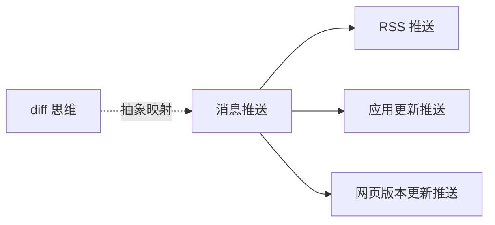

# 消息推送：RSS、应用更新、网页版本更新与 diff 思维对照报告

## 目的

汇总本轮围绕 [Web端版本更新弹窗实现](../sources/webpage-version-update-popup-implementation.md) 展开的连续讨论，把它与：

- [RSS / Telegram 自建推送](../concepts/rss-telegram-selfhost.md)
- [`electron-updater` 所代表的应用更新推送](../queries/web-version-json-vs-electron-updater.md)
- [`git diff` / 文件差异比对](../queries/git-diff-and-web-version-check.md)

放到同一套分析框架下，形成一份可复用的总报告。

## 一句话结论

这几条线表面都在讨论“推送”或“diff”，但它们分别落在不同层级：

- **网页版本更新推送**：更偏“发现变化并提醒刷新”
- **RSS 推送**：更偏“发现新内容并向外部分发”
- **应用更新推送**：更偏“发现新版本并完成下载安装”
- **`git diff`**：更偏“表达两个状态之间的内容差异”

如果抽象到统一模型，它们都可以被看成：

1. 先拿到两个状态
2. 判断是否存在差异
3. 根据差异触发后续动作

差异主要在于：

- 比较的对象是什么
- 差异粒度有多细
- 差异后续动作有多重

## 总图

## 统一分析框架

这轮讨论里，最后稳定下来的一个很有用的框架是：把系统拆成“状态比对驱动动作”的结构。

### 共同骨架

任何一条线，本质都在回答三件事：

1. **如何发现更新**
2. **如何判断差异**
3. **差异出现后如何处理**

进一步展开，还可以变成五层：

1. **更新发现层**：轮询、长轮询、WebSocket、SSE、Push
2. **状态描述层**：版本号、feed、manifest、文件 hash
3. **差异判断层**：版本级 diff、条目级 diff、文件级 diff、内容级 diff
4. **动作执行层**：弹窗、发消息、下载、安装、回滚
5. **用户交互层**：是否提示、何时提示、能否稍后、是否自动执行

这套框架是整份报告的主轴。

## 一、网页版本更新推送

对应来源：

- [来源：Web端版本更新弹窗实现](../sources/webpage-version-update-popup-implementation.md)
- [查询：Web端版本更新弹窗这篇文章里的方案有什么问题，有更好的方案吗](../queries/review-web-version-update-popup-scheme.md)

### 1. 它解决什么问题

目标是：

- 页面已经打开
- 服务器部署了新版本
- 浏览器当前还停留在旧版本
- 需要提醒用户刷新

### 2. 它的抽象结构

- **更新发现层**：浏览器轮询 `version.json`
- **状态描述层**：本地版本号 vs 远端版本号
- **差异判断层**：只判断“版本是否不同”
- **动作执行层**：弹窗、刷新页面
- **用户交互层**：立即更新 / 稍后提醒

### 3. 它的特点

- 成本低
- 不依赖复杂服务端
- 适合低频更新
- 差异粒度很粗，只到“版本号级”

### 4. 我们讨论中识别出的局限

- demo 首次访问会误判成新版本
- `reload(true)` 不能跨浏览器依赖
- `version.json?t=Date.now()` 粗暴但有效
- “稍后提醒”缺少节流
- 整体属于“更新提醒系统”，不是“更新分发系统”

## 二、RSS 推送

对应来源：

- [RSS / Telegram 自建推送](../concepts/rss-telegram-selfhost.md)
- [来源：Gemini 对话——indes/flowerss-bot 项目原理](../sources/gemini-flowerss-bot-principle.md)
- [查询：Web端版本更新弹窗的数据推送跟 RSS 方案有什么异同](../queries/web-version-popup-vs-rss.md)

### 1. 它解决什么问题

目标是：

- 有多个 RSS / Atom 内容源
- 需要聚合这些源
- 一旦有新条目，就推到 Telegram

### 2. 它的抽象结构

- **更新发现层**：Bot 定时轮询 RSS/Atom feed
- **状态描述层**：feed 条目列表、GUID、链接、更新时间
- **差异判断层**：条目级去重，判断哪些是新内容
- **动作执行层**：调用 Telegram Bot API 推送消息
- **用户交互层**：用户在 TG 里查看，不必停留在源网页

### 3. 它的特点

- 体感像“推送”，本质上仍是“定时拉取 + 二次分发”
- 比网页版本更新更偏“内容分发系统”
- 差异粒度比版本号更细，到“条目级”
- 送达通道脱离源站，用户体验更像订阅产品

### 4. 和网页版本更新的关系

相同点：

- 都是先比较两个状态
- 都不是严格源站实时主动推送
- 都依赖某种轮询或定时拉取

不同点：

- 网页更新只关心“站点是否整体变了”
- RSS 关心“有没有新内容条目”
- 网页更新的动作是刷新
- RSS 的动作是外部分发消息

## 三、应用更新推送

对应来源：

- [查询：`version.json + 轮询弹窗` 方案，对照 `electron-updater` 该怎么理解](../queries/web-version-json-vs-electron-updater.md)
- [查询：刚刚讨论的差异对比，如果用在 app 文件 diff 场景里该怎么理解](../queries/app-file-diff-with-update-delivery.md)

### 1. 它解决什么问题

目标是：

- 客户端已有旧版本 app
- 服务端有新版本 app
- 希望自动或半自动升级

### 2. 它的抽象结构

- **更新发现层**：客户端检查更新
- **状态描述层**：`latest.yml` / manifest / 文件清单 / 校验信息
- **差异判断层**：版本差异、文件差异、块级差异
- **动作执行层**：下载、校验、安装、重启
- **用户交互层**：立即安装、退出安装、后台下载、灰度发布

### 3. 它的特点

- 不只是提醒“变了”，还要负责“怎么更新”
- 差异粒度可到文件级、chunk 级、patch 级
- 关注完整性校验、失败回滚、增量下载
- 本质是“应用分发系统”

### 4. 它和网页版本更新的关系

可以把网页版本更新方案看成一个极简前身：

- 网页版本更新只覆盖：
  - 发现变化
  - 提示用户

- `electron-updater` 还覆盖：
  - 更新元数据清单
  - 差分下载
  - 下载校验
  - 安装执行
  - 灰度发布

所以两者不是矛盾关系，而是成熟度和覆盖范围不同。

## 四、`git diff` 与 diff 思维

对应来源：

- [查询：`git diff` 这种差异对比，和 Web 端版本更新弹窗的思路是不是有异曲同工之处](../queries/git-diff-and-web-version-check.md)
- [查询：如果是应用内的文件更新，像 `git diff` 这种，跟前面说的应用更新有什么区别](../queries/in-app-file-update-vs-app-updater-vs-git-diff.md)

### 1. 为什么会聊到 `git diff`

因为在讨论版本更新、应用更新、文件同步时，我们不断用到“diff”这个词。  
但最后澄清下来，`git diff` 更适合作为一个**抽象参照系**，而不是直接等同于更新系统。

### 2. 它解决什么问题

目标是：

- 比较两个文本状态
- 输出具体内容差异

### 3. 它和前面三类系统的共同点

共同点在于：

- 都需要有两个基线
- 都要判断差异是否存在
- 都是“差异驱动后续动作”

### 4. 它的关键不同

- `git diff` 更关心“**具体改了什么**”
- 网页版本更新更关心“**只要知道变了就够了**”
- RSS 更关心“**哪些条目是新的**”
- 应用更新更关心“**哪些文件 / 块需要更新，以及如何安全应用**”

如果硬要类比：

- 网页版本更新更像 `git diff --quiet`
- 应用更新更像“程序可执行的 manifest / patch diff”
- RSS 更像“新条目集合 diff”

## 五、应用内文件更新：介于应用更新与 `git diff` 之间

这是我们讨论中间出现的一个重要过渡层。

### 1. 它解决什么问题

目标是更新 app 运行时依赖的文件，而不是更新 app 本体，例如：

- 配置
- 模板
- 规则
- 模型
- 游戏资源

### 2. 它的结构

- **更新发现层**：轮询 / Push / 内部通知
- **状态描述层**：manifest、文件路径、hash、size、版本
- **差异判断层**：文件级 diff、hash diff、chunk diff
- **动作执行层**：下载、校验、替换、热加载

### 3. 它和 `git diff` 的关系

相通之处：

- 都是在回答“旧状态和新状态有何不同”

不同之处：

- `git diff` 面向文本内容表达
- 应用内文件更新面向程序执行与资源同步

真实工程里，应用内文件更新更常见的是：

- manifest + hash 对比
- 必要时 binary patch

而不是直接发一个 `git diff` 给客户端去打补丁。

## 横向对照表

| 维度 | 网页版本更新推送 | RSS 推送 | 应用更新推送 | `git diff` |
| --- | --- | --- | --- | --- |
| 核心目标 | 提醒页面刷新 | 分发新内容 | 升级应用版本 | 表达文本差异 |
| 比较对象 | 当前页版本 vs 远端版本 | 已推送条目 vs feed 条目 | 本地版本/文件 vs 远端 manifest | 两份文本内容 |
| 差异粒度 | 版本号级 | 条目级 | 文件级 / chunk 级 / patch 级 | 行级 / hunk 级 |
| 发现更新方式 | 轮询为主 | 轮询 feed 为主 | 检查更新 / manifest | 手动或版本控制触发 |
| 后续动作 | 弹窗、刷新 | 发消息 | 下载、校验、安装、重启 | 审查、合并、打 patch |
| 关注重点 | 缓存、提示时机 | 去重、外部分发 | 清单、校验、回滚 | 差异可读性与可合并性 |

## 核心收获

### 1. “推送”不等于“源头主动发出”

这是整轮讨论中反复澄清的点：

- RSS 体感像推送，但底层是定时拉取
- 网页更新弹窗也是轮询检测
- 真正的“推送协议”只是更新发现层的一个实现

### 2. 不同系统最大的区别，不在“有没有 diff”，而在“diff 粒度”和“后续动作”

- 网页版本更新：知道变了就够了
- RSS：知道哪条内容新了
- 应用更新：知道哪些文件 / 块变了，还要安全更新
- `git diff`：知道文本具体怎么变了

### 3. 一个很稳的通用抽象是“状态比对驱动动作”

这可以作为后续继续分析其它系统的总框架：

1. 旧状态是什么
2. 新状态是什么
3. 差异如何表示
4. 差异后做什么

## 后续可继续展开的题目

基于这轮讨论，后面很适合继续写成独立主题的有：

1. `version diff`、`manifest diff`、`git diff` 三种 diff 的系统化对照
2. 从网页版本弹窗到 `electron-updater`：为什么说前者是后者的极简前身
3. RSS 为什么“看起来是推送，本质却是轮询 + 分发”
4. 应用内文件更新的最小设计：manifest、hash、替换、热加载

## 相关页面

- [来源：Web端版本更新弹窗实现](../sources/webpage-version-update-popup-implementation.md)
- [RSS / Telegram 自建推送](../concepts/rss-telegram-selfhost.md)
- [查询：Web端版本更新弹窗的数据推送跟 RSS 方案有什么异同](../queries/web-version-popup-vs-rss.md)
- [查询：Web端版本更新弹窗里的几种推送方式，对 RSS 推送机制有什么可借鉴之处](../queries/web-update-patterns-for-rss.md)
- [查询：Web端版本更新弹窗这篇文章里的方案有什么问题，有更好的方案吗](../queries/review-web-version-update-popup-scheme.md)
- [查询：刚刚讨论的差异对比，如果用在 app 文件 diff 场景里该怎么理解](../queries/app-file-diff-with-update-delivery.md)
- [查询：`version.json + 轮询弹窗` 方案，对照 `electron-updater` 该怎么理解](../queries/web-version-json-vs-electron-updater.md)
- [查询：如果是应用内的文件更新，像 `git diff` 这种，跟前面说的应用更新有什么区别](../queries/in-app-file-update-vs-app-updater-vs-git-diff.md)
- [查询：`git diff` 这种差异对比，和 Web 端版本更新弹窗的思路是不是有异曲同工之处](../queries/git-diff-and-web-version-check.md)
